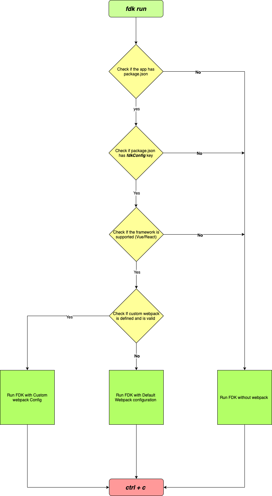

##  Introduction
Freshworks developer platform now supports React local development natively in the FDK through [Webpack 5](https://webpack.js.org/blog/2020-10-10-webpack-5-release/). This documentation is intended to walk you through the implementation in the FDK, and the process to follow to get started with the React development using the FDK.

### Implementation

The FDK comes built-in with Webpack 5 and a Webpack configuration file to mount during the compilation and the build phases, whenever the FDK detects the project is developed with React, the project is compiled using the Webpack with default Webpack configuration.

Though the FDK has a default Webpack configuration for React apps, It is possible to provide custom configurations, the guidelines to define [custom Webpack configurations](/react/#custom-webpack-config) are addressed in the latter part of this documentation.

### Create your first React app

To create a new React project,

1. Update the FDK to the latest version.

2. Create a new folder named my_app and open the terminal/command prompt inside the newly created folder

```shell
vel@freshworks:~$ mkdir my_app && cd my_app
```

3. Run _fdk create_ and select the product of your choice.


4. Once you have chosen the desired product and select _your_first_react_app_ template.


5. After creating the project, run _npm install_ to install all the dependencies and devDependencies.

```shell
vel@freshworks:~/my_app$ npm install
```


### React app folder structure

The React App in the Freshworks ecosystem is similar to the React app created using create-react-app or a React app bundled using the Webpack, with some minor changes in the folder structure to support integration with the FDK.

The folder structure of the React app is explained below

```shell
  ├── __mocks__
  │   └── svgrMock.js
  ├── app                               
  │   ├── icon.svg
  │   └── index.html                   
  ├── config
  │   └── iparams.json
  ├── jest.config.js                    
  ├── manifest.json
  ├── package.json                      
  ├── public
  │   └── index.html                   
  ├── setUpTests.js
  └── src                               
      ├── App.css
      ├── App.js
      ├── App.test.js
      ├── assets
      │   ├── icon.svg
      │   └── logo.svg
      ├── components                   
      │   └── HelloUser.js
      ├── hooks
      │   └── useScript.js
      ├── index.css
      ├── index.js              
      └── logo.svg
```

#### The manifest.json file

The `manifest.json` file contains the app metadata about your app, such as app locations, platform version, and other app related information
#### The package.json file

The `package.json` file contains the information about the framework used and the dependencies and devDependencies used by the and configurations if any. 

#### The app folder
The `app` folder contains the built/compiled app and the content of the app folder is served by the FDK in `http://localhost:10001/iframe` during *`fdk run`*

::: warning

* Do not delete, replace or modify the `index.html` file inside the app folder, any changes made will be overwritten during the build. If you need to add or remove anything in the `app/index.html`, make sure you do it in `public/index.html` as it serves as the template file for `app/index.html`

* Replace the `icon.svg` file in the app folder, if you choose to use a custom icon for the app. Make sure you change the name of the icon in `manifest.json` to the replaced/newly added image.

* If you choose to use a [custom webpack config](/react/#custom-webpack-config), make sure the output always points to the app folder or its subfolders.  
:::

#### The Config folder
The `config` folder contains the installation parameter of the app.

::: danger

* Do not define your [custom webpack config](/react/#custom-webpack-config) inside the `config` folder
:::

#### The src folder 

The `src` folder contains your react components and services.
#### The public folder

The `public` folder contains an `index.html` file which serves as a template to the `app/index.html`. Adding css or script to the app can be done in the `public/index.html`. 
#### The jest.config.js file

The jest.config.js contains the configurations related to jest unit tests. Alternatively, this can be direclty defined in the `package.json` like shown below.

*package.json*
```json 
  "scripts": {
    "test": "jest test --coverage"
  },
  "jest": {
    "roots": [
      "./app/src"
    ]
  }
```

#### The setUpTests.js file

The `setupTests.js` is needed when your app uses a browser API that you need to mock in your tests or if you need a global setup before running your tests, It will be automatically executed before running your tests.

To know more about `setupTests.js`, please visit [this](https://create-react-app.dev/docs/running-tests/#initializing-test-environment) link

#### The `__mocks__` folder

The `__mocks__` folder contains all the manual mocks required by jest as per jest's naming convention.

Please visit [this](https://jestjs.io/docs/manual-mocks) link to know more about `__mocks__`

### Run your first React app using the FDK

Running a React app locally using the FDK is similar to running any other app,

- Open the app folder in terminal and run _fdk run_

  ```shell
  vel@freshworks:~/my_app$ fdk run
  ```

- The FDK runs the app with Webpack if `package.json` is present in the root folder of the project with the following object,

  ```json
    "fdkConfig": {
      "frontendFramework": "react",
      "customConfig": ""
    }
  ```

- The `frontendFramework` key in the `fdkConfig` objects denotes the framework of the project, FDK currently supports

  1. React
  2. Vue
  3. Vue3

- The `customConfig` key denotes the path of the custom Webpack config you want to provide, although this is not mandatory, the FDK will use the default config if any of the following scenarios holds true.

  1. when there is no `customConfig` key in fdkConfig
  2. when `customConfig` is an empty string
  3. when the path provided is not a valid path.

::: warning
The path to the custom Webpack config module should be relative to the app's root folder.
:::

### Lifecycle of a FDK React App

Lifecycle/App execution flow of a React app in FDK is shown in the image below. 



## Usage of existing frontend platform features in React

All the frontend features and interfaces should work as they would in the normal frontend app created using vanillaJS or JQuery, Although there few features that had to be implemented in a different way due to the restrictions imposed by React.

### Injecting the freshclient.js

The `fresh_client.js` is the interface that bridges your app and the developer platform. The `fresh_client.js` enables you to access the platform features such as request, db, interface, and instance through the client object.

In the normal vanilla Freshworks application, the `fresh_client.js' is included in the template.html as a script src like shown below

```html
<!DOCTYPE html>
<html lang="en">
	<head>
		<meta charset="UTF-8" />
		<meta name="viewport" content="width=device-width, initial-scale=1.0" />
		<meta http-equiv="X-UA-Compatible" content="ie=edge" />
		<script src="https://static.freshdev.io/fdk/2.0/assets/fresh_client.js"></script>
	</head>
	<body>
		<div id="app"></div>
	</body>
</html>
```

Unlike the vanillaJS application, we will not be able to include the `fresh_client.js` inside the index.html, instead, the script is added to the app using React hooks like the example below

```javascript
import React, { useState, useEffect } from "react";
import "./App.css";
import Child from "./compoenents/Child";

const App = () => {
	const [loaded, setLoaded] = useState(false);
	const [child, setChild] = useState(<h3>App is loading</h3>);

	useEffect(() => {
		const script = document.createElement("script");
		script.src = "https://static.freshdev.io/fdk/2.0/assets/fresh_client.js";
		script.addEventListener("load", () => setLoaded(true));
		script.defer = true;
		document.head.appendChild(script);
	}, []);

	useEffect(() => {
		if (!loaded) return;
		app.initialized().then((client) => {
			setChild(<Child client={client} />);
		});
	}, [loaded]);

	return (
		<div>
			<header>My React App</header>
			{child}
		</div>
	);
};

export default App;
```


### Passing the client Object to the child components.

Once the `fresh_client.js` is loaded, all the platform features can be accessed in the React app through the client object, the client object can then be passed down to the child components as a prop like shown below

```javascript
return (
	<div>
		<Child client={client} />
	</div>
);
```

you can find a sample app that addresses passing down of props to the child component in this [link](#)


### Render App in multiple app locations

One of the most significant features of the Freshworks developer platform is to render an app in multiple locations, and it can be achieved by defining multiple template `html` files in manifest.json like shown in the example below

*manifest.json*
```json
{
	"platform-version": "2.1",
	"product": {
		"freshdesk": {
			"location": {
				"ticket_sidebar": {
					"url": "index.html",
					"icon": "icon.svg"
				},
				"full_page_app": {
					"url": "full_page.html",
					"icon": "icon.svg"
				}
			}
		}
	}
}
```

Since React is a Single Page Application framework it is not possible to define multiple `html` files for a single app
but you can make use of the instance to achieve the same behavior and render different React components based on the app location instead of template `html` file


*App.js*
```javascript
import React, { useState, useEffect } from "react";
import "./App.css";
import HelloUser from "./components/HelloUser";
import Fullpage from "./components/Fullpage";
import Modal from "./components/Modal";


const App = () => {
	const [loaded, setLoaded] = useState(false);
	const [child, setChild] = useState(<h3>App is loading</h3>);

	useEffect(() => {
		const script = document.createElement("script");
		script.src = "https://static.freshdev.io/fdk/2.0/assets/fresh_client.js";
		script.addEventListener("load", () => setLoaded(true));
		script.defer = true;
		document.head.appendChild(script);
	}, []);

	useEffect(() => {
		if (!loaded) return;
		app.initialized().then((client) => {
			client.instance.context().then(function (data) {
				let location = data.location;

				if (location === "ticket_sidebar") {
					setChild(<HelloUser client={client} />);
				}
				if (location === "full_page_app") {
					setChild(<Fullpage client={client} />);
				}
				if (location === "modal") {
					setChild(<Modal client={client} />);
				}
			});
		});
	}, [loaded]);

	return <div>{child}</div>;
};

export default App;
```

*manifest.json*
```json
{
	"platform-version": "2.1",
	"product": {
		"freshdesk": {
			"location": {
				"ticket_sidebar": {
					"url": "index.html",
					"icon": "icon.svg"
				},
				"full_page_app": {
					"url": "index.html",
					"icon": "icon.svg"
				}
			}
		}
	}
}
```

The logic discussed above can also be applied to interface methods like modals.


::: tip
All the app locations and interface methods in a React app should point to the same template html file, for eg: index.html or the custom html defined by you in the Webpack config, though it is possible to use multiple html files and initialize fresh_client.js in all the html files, it is not recommended.
:::

## Custom Webpack Config

FDK comes with a provision to provide custom webpack configuration, you can define the custom webpack configuration by providing a path to the configuration on the package.json file of the app.

The path to the configuration is provided in the `configPath` of the `fdkConfig` in package.json

*package.json*

```json
{
  "name": "react-webpack-dev",
  "version": "1.0.0",
  "main": "index.js",
  "license": "MIT",
  "fdkConfig":{
    "frontendFramework": "react", 
    "configPath": "webpack-config/webpack.config.js" // path to Your Custom Webpack config, under /webpack-config folder
  },
  "devDependencies": {
    "@babel/plugin-transform-spread": "^7.13.0",
    "@testing-library/jest-dom": "^5.11.6",
    "html-loader": "^1.3.2",
    "jest": "^26.6.3",
    "jest-css-modules": "^2.1.0"
  },
  "dependencies": {
    "@testing-library/react": "^11.1.0",
    "@testing-library/user-event": "^12.1.10",
    "react": "^17.0.1",
    "react-dom": "^17.0.1",
    "react-scripts": "4.0.0"
  },
  "scripts": {
    "test": "jest test --coverage",
    "code-sanity": ""
  },
  "jest": {
    "roots": [
      "./app/src"
    ]
  }
}
```

### Default config

The code snippet shown below is the defalt webpack configuration that comes with the FDK, you can choose to make whatever changes you wish to the configuration, but make sure you follow the guideilnes given below

1. The `output` should always point to or be inside the app directory, so the app can packed properly during *fdk pack* 
2. If you use any new dependencies in the configuration, make sure you install the dependencies inside the project. 

```js
'use strict';

const HtmlWebPackPlugin = require('html-webpack-plugin');
const { CleanWebpackPlugin } = require('clean-webpack-plugin');
const MiniCssExtractPlugin = require('mini-css-extract-plugin');


module.exports = {
  entry: {
    main: ['@babel/polyfill', `${process.cwd()}/src/index.js`]
  },
  output: {
    globalObject: 'this',
    path: `${process.cwd()}/app/scripts`,
    filename: '[name].[contenthash:8].js',
    chunkFilename: '[name].[contenthash:8].js',
    publicPath: './scripts'
  },
  devtool: 'source-map',
  module: {
    rules: [
      {
        test: /\.(js|jsx|ts|tsx|test.js)$/,
        exclude: /node_modules/,
        use: {
          loader: 'babel-loader'
        }
      },
      {
        test: /\.(css|scss)$/,
        use: [
          'style-loader',
          'css-loader'
        ]
      },
      {
        test: /\.(png|jpe?g|gif|svg)$/i,
        use: [
          {
            loader: 'file-loader',
            options: {
              name: '[name][contenthash:8].[ext]',
              outputPath: '/assets/img',
              esModule: false
            }
          }
        ]
      },
      {
        test: /\.html$/,
        use: [
          {
            loader: 'html-loader'
          }
        ]
      }
    ]
  },
  plugins: [
    new CleanWebpackPlugin({
      dangerouslyAllowCleanPatternsOutsideProject: true,
      dry: false
    }),
    new MiniCssExtractPlugin({
      filename: '[name].[contenthash:8].css',
      chunkFilename: '[name].[contenthash:8].css'
    }),
    new HtmlWebPackPlugin({
      template: `${process.cwd()}/public/index.html`,
      filename: `${process.cwd()}/app/index.html`
    })
  ],
  optimization: {
    moduleIds: 'deterministic',
    runtimeChunk: 'single',
    splitChunks: {
      cacheGroups: {
        vendor: {
          test: /[\\/]node_modules[\\/]/,
          name: 'vendors',
          priority: -10,
          chunks: 'all'
        }
      }
    }
  }
};

```


### Sample Custom config

A sample custom config to place the built javascript assets inside `js` folder instead of the default `scripts` folder

```js
'use strict';

const HtmlWebPackPlugin = require('html-webpack-plugin');
const { CleanWebpackPlugin } = require('clean-webpack-plugin');
const MiniCssExtractPlugin = require('mini-css-extract-plugin');


module.exports = {
  entry: {
    main: ['@babel/polyfill', `${process.cwd()}/src/index.js`]
  },
  output: {
    globalObject: 'this',
    path: `${process.cwd()}/app/scripts`,
    filename: '[name].[contenthash:8].js',
    chunkFilename: '[name].[contenthash:8].js',
    publicPath: './js'
  },
  devtool: 'source-map',
  module: {
    rules: [
      {
        test: /\.(js|jsx|ts|tsx|test.js)$/,
        exclude: /node_modules/,
        use: {
          loader: 'babel-loader'
        }
      },
      {
        test: /\.(css|scss)$/,
        use: [
          'style-loader',
          'css-loader'
        ]
      },
      {
        test: /\.(png|jpe?g|gif|svg)$/i,
        use: [
          {
            loader: 'file-loader',
            options: {
              name: '[name][contenthash:8].[ext]',
              outputPath: '/assets/images',
              esModule: false
            }
          }
        ]
      },
      {
        test: /\.html$/,
        use: [
          {
            loader: 'html-loader'
          }
        ]
      }
    ]
  },
  plugins: [
    new CleanWebpackPlugin({
      dangerouslyAllowCleanPatternsOutsideProject: true,
      dry: false
    }),
    new MiniCssExtractPlugin({
      filename: '[name].[contenthash:8].css',
      chunkFilename: '[name].[contenthash:8].css'
    }),
    new HtmlWebPackPlugin({
      template: `${process.cwd()}/public/index.html`,
      filename: `${process.cwd()}/app/index.html`
    })
  ],
  optimization: {
    moduleIds: 'deterministic',
    runtimeChunk: 'single',
    splitChunks: {
      cacheGroups: {
        vendor: {
          test: /[\\/]node_modules[\\/]/,
          name: 'vendors',
          priority: -10,
          chunks: 'all'
        }
      }
    }
  }
};

```