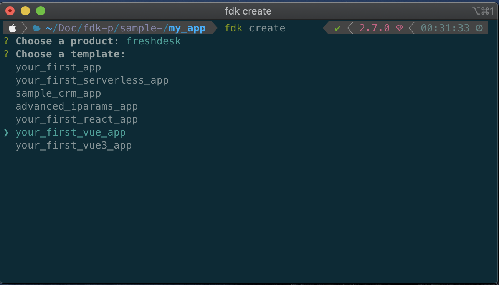
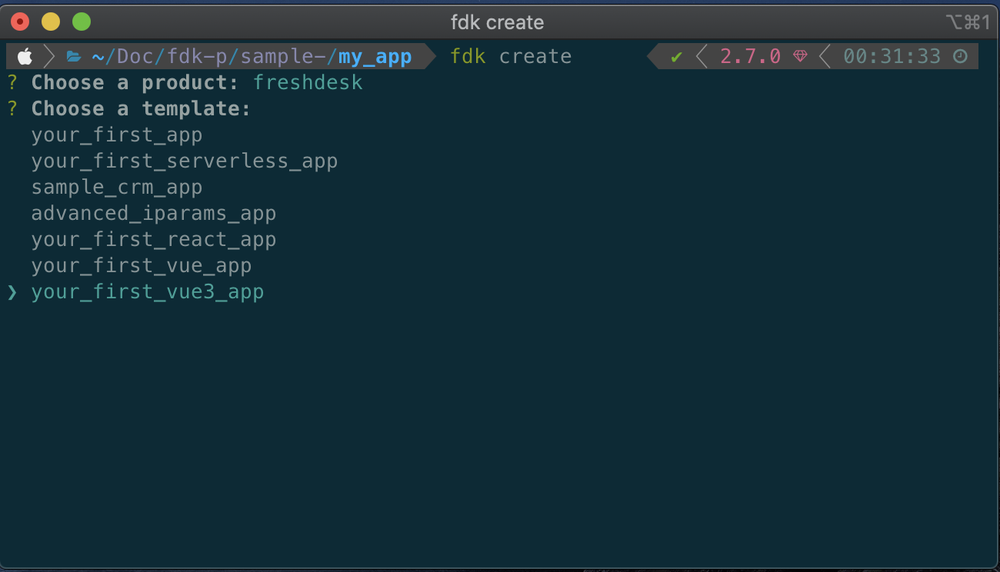

## Introduction

Freshworks developer platform now supports Vue local development natively in the FDK through Webpack. This documentation is intended to walk you through the implementation in FDK, and the process to be followed to start with the development using Vue.

::: tip
FDK supports both Vue version 2 and version 3, make sure you choose the right template while creating a new app.
:::

### Implementation

The FDK comes built-in with Webpack 5 and a Webpack configuration file to mount during the compilation, whenever FDK detects the project is developed with Vue, the project is compiled using Webpack with the default Webpack configuration. Though the FDK has a default Webpack configuration for Vue, It is possible to provide your own configuration, the guidelines for that are addressed in the latter part of this documentation.

### Create your first Vue app

To create a new Vue project,

1. Update the FDK to the latest version.

2. Create a new folder named my_app and open the terminal/command prompt inside the newly created folder

```shell
vel@freshworks:~$ mkdir my_app && cd my_app
```

3. Run _fdk create_ and select the product of your choice.


4. Once you have chosen the desired product, select either your_first_vue_app or your_first_vue3_app template,



<div align="center">
OR
</div>



5. After creating the project, run _npm install_ to install all the dependencies and devDependencies.

```shell
vel@freshworks:~/my_app$ npm install
```


### Vue app folder structure

The Vue App in the Freshworks ecosystem is similar to the Vue app created using vue-cli or a Vue app bundled using the Webpack, with some minor changes in the folder structure to support integration with the FDK.

The folder structure of the Vue app is given below

```shell
  ├── app
  │   ├── icon.svg
  │   └── index.html
  ├── babel.config.js
  ├── config
  │   └── iparams.json
  ├── manifest.json
  ├── package-lock.json
  ├── package.json
  ├── public
  │   └── index.html
  └── src
      ├── App.vue
      ├── assets
      │   ├── icon.svg
      │   ├── logo.png
      │   └── vuejs.svg
      ├── components
      │   └── Sidebar.vue
      └── main.js
```

### Run your first Vue app using the FDK

Running a Vue app using FDK is similar to running any other app,

- Open the app folder in terminal and run _fdk run_

  ```shell
  vel@freshworks:~/my_app$ fdk run
  ```

- The FDK runs the app with Webpack if `package.json` is present in the root folder of the project with the following object,

  ```json
    "fdkConfig": {
      "frontendFramework": "vue",
      "customConfig": ""
    }
  ```

- the `frontendFramework` key in the `fdkConfig` objects denotes the framework of the project, FDK currently supports

  1. React
  2. Vue
  3. Vue3

- the `customConfig` key denotes the path of the custom Webpack config you want to provide, although the `customConfig` not mandatory, the FDK will use the default config if any of the following scenarios holds true.

  1. when there is no `customConfig` key in fdkConfig
  2. when `customConfig` is an empty string
  3. when the path provided is not a valid path.

::: warning
The path to the custom Webpack config module should be relative to the app's root folder.
:::


## Usage of existing frontend platform features in Vue

All the frontend features and interfaces should work as they would in the normal frontend app created using vanillaJS or JQuery, Although there few features that had to be implemented in a different way due to the restrictions imposed by Vue.

### Injecting the freshclient.js

The `fresh_client.js` is the interface that bridges your app and the developer platform. The `fresh_client.js` enables you to access the platform features such as request, db, interface, and instance through the client object.

In the normal vanilla Freshworks application, the `fresh_client.js' is included in the template.html as a script src like shown below

```html
<!DOCTYPE html>
<html lang="en">
	<head>
		<meta charset="UTF-8" />
		<meta name="viewport" content="width=device-width, initial-scale=1.0" />
		<meta http-equiv="X-UA-Compatible" content="ie=edge" />
		<script src="https://static.freshdev.io/fdk/2.0/assets/fresh_client.js"></script>
	</head>
	<body>
		<div id="app"></div>
	</body>
</html>
```

Like in the vanillaJS application, you can include the `fresh_client.js` direclty in the `public/index.html`.

```html
<!DOCTYPE html>
<html lang="en">
	<head>
		<meta charset="UTF-8" />
		<meta name="viewport" content="width=device-width, initial-scale=1.0" />
		<meta http-equiv="X-UA-Compatible" content="ie=edge" />
		<script src="https://static.freshdev.io/fdk/2.0/assets/fresh_client.js"></script>
	</head>
	<body>
		<div id="app"></div>
		<!-- built files will be auto injected -->
	</body>
</html>
```

### Passing the client Object to the child components.

Once the `fresh_client.js` is loaded, all the platform features can be accessed in the Vue app through the client object, the client object can then be passed down to the child components as a prop like shown below

*App.vue*

```javascript
<template >
  <div>
      <Sidebar :client="client" />
  </div>
</template>
```

you can find a sample app that addresses passing down of props to the child component in this [link](#)

### Render App in multiple app locations

One of the most significant features of the Freshworks developer platform is to render an app in multiple locations, and it can be achieved by defining multiple template `html` files in manifest.json like shown in the example below

_manifest.json_

```json
{
	"platform-version": "2.1",
	"product": {
		"freshdesk": {
			"location": {
				"ticket_sidebar": {
					"url": "index.html",
					"icon": "icon.svg"
				},
				"full_page_app": {
					"url": "full_page.html",
					"icon": "icon.svg"
				}
			}
		}
	}
}
```

Since react is a Single Page Application framework it is not possible to define multiple `html` files for a single app
but you can make use of the instance to achieve the same behavior and render different Vue components based on the app location instead of the template `html` file

_App.vue_

```js

<template >
  <div v-if="location === 'username'">
      <Sidebar :client="client" />
  </div>
  <div v-if="location === 'full_page_app'">
      <Fullpage :client="client" />
  </div>
  <div v-if="location === 'modal'">
      <Modal :client="client" />
  </div>
</template>


<script>
import Sidebar from "./components/Sidebar.vue";
import Fullpage from "./components/Fullpage.vue";
import Modal from "./components/Modal.vue";

export default {
  mounted() {
    this.get();
  },
  name: "App",
  components: {
    Sidebar,
  },
  data() {
    return {
      client: {},
      location: ''
    };
  },
  methods: {
    get() {
      app.initialized().then((client) => {
        this.client = client;
        client.instance.context().then(function (data) {
           this.location = data.location;
			});
      });
    },
  },
};

</script>

<style scoped>

</style>

```

_manifest.json_

```json
{
	"platform-version": "2.1",
	"product": {
		"freshdesk": {
			"location": {
				"ticket_sidebar": {
					"url": "index.html",
					"icon": "icon.svg"
				},
				"full_page_app": {
					"url": "index.html",
					"icon": "icon.svg"
				}
			}
		}
	}
}
```

The logic discussed above can also be applied to interface methods like modals.


::: tip
All the app locations and interface methods in a Vue app should point to the same template html file, for eg: index.html or the custom html defined by you in the Webpack config, though it is possible to use multiple html files and initialize fresh_client.js in all the html files, it is not recommended.
:::
